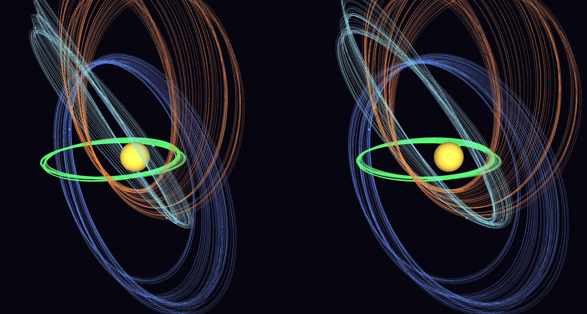

# Gravity3D

A 3D N-body gravity simulator/visualiser in C++ (OpenGL 3.3). Loads a scene of
objects from a file and shows the motion with selectable projections, stereoscopic
3D modes, VR output, adjustable speed, pause/restart, and configurable motion trails.

---

## Youtube video

[](https://www.youtube.com/watch?v=YDwR3YTCMC0)

## Features at a glance

| Requirement | How it's covered |
|---|---|
| Load objects from a file (name, mass, position, velocity, colour) | `data/*.csv`, see **Scene file format** |
| Single-camera projections | Keys `1`–`4`: Front · Isometric · Axonometric · Oblique (cabinet) |
| "American projection" (third-angle) | `F7` **multiview**; key `5` toggles third-angle (American) / first-angle (ISO/European) — see **Projection standards** |
| Anaglyph 3D | `F2` — red/cyan |
| Straight & cross-eye stereo | `F3` (parallel) · `F4` (cross-eye) |
| VR headset | `F5` side-by-side (phone/Cardboard) · `F6` OpenXR (real PC-VR headset, via SteamVR) — see **Running in VR (OpenXR)** |
| Simulation speed | `+` / `-` |
| Pause / restart | `Space` / `R` |
| Trail stays vs. moves with object | `T` cycles Off → Follow (moves along) → Stay (persists) |

---

## Building on Windows

Prerequisites: **Visual Studio 2019/2022** (Desktop C++ workload) and **CMake ≥ 3.16**
(the VS installer includes it). GLFW and GLM are downloaded automatically by CMake;
the OpenGL loader (GLAD) is already vendored in the repo, so there is nothing extra
to install for the core build.

```bat
cd gravity3d
cmake -S . -B build
cmake --build build --config Release
build\Release\gravity3d.exe
```

The sample scene is copied next to the executable, so it runs with no arguments.
To load your own file: `gravity3d.exe path\to\your_scene.csv`

### Optional: real VR (OpenXR)

```bat
cmake -S . -B build -DENABLE_OPENXR=ON
cmake --build build --config Release
```

This pulls the Khronos OpenXR-SDK and enables the `F6` headset path. There's an
important runtime requirement (it must be an OpenGL-capable OpenXR runtime, i.e.
SteamVR) — see **Running in VR (OpenXR)** below for the full setup.

> Builds on Linux too (needs `cmake`, `libgl1-mesa-dev`, `xorg-dev`); macOS is
> limited to OpenGL 3.3 / 4.1 and has no OpenXR path.

---

## Controls

```
Projection    1 Front   2 Isometric   3 Axonometric   4 Oblique
View mode     F1 Mono   F2 Anaglyph   F3 Stereo-Parallel   F4 Stereo-Cross
              F7 Multiview (engineering 3-view)
              F5 VR side-by-side (fullscreen it)   F6 VR OpenXR
Multiview     5    toggle Third-angle (American) / First-angle (ISO/European)
Perspective   P    toggle ortho/perspective for Front/Iso/Axono
Trails        T    cycle Off / Follow / Stay
Speed         + / -
Pause         Space          Restart   R
Stereo tune   [ ] eye separation      , . convergence distance
VR placement  scroll = scale   arrows = move (up/down/near/far)   drag = rotate   0 = reset
Camera        drag = orbit    scroll = zoom   (zoom also scales the multiview)
Fullscreen    F11            Quit  Esc
```

Current state is always shown in the window title bar. VR-specific controls (`F6`)
are described under **Running in VR (OpenXR)** below.

---

## Running in VR (OpenXR)

`F6` renders true per-eye stereo to a PC-VR headset through OpenXR. It has been run
successfully on a **Meta Quest** via Link / Virtual Desktop → SteamVR. The scene
appears as a small "hologram" floating in front of you that you can scale, move and
rotate.

### 1. Build with the OpenXR path enabled

It's **off by default**. Turn it on and rebuild:

```bat
cmake -S . -B build -DENABLE_OPENXR=ON
cmake --build build --config Release
```

### 2. Use SteamVR as the OpenXR runtime (important)

This app renders with **OpenGL**. Meta's native PC runtime (Oculus / Horizon Link)
and Virtual Desktop's own **VDXR** runtime only accept Direct3D/Vulkan, so an OpenGL
app cannot create a session on them. **SteamVR's runtime does support OpenGL**
(`XR_KHR_opengl_enable`), so route through SteamVR:

- **Meta Quest:** connect via **Link / Air Link**, *or* in **Virtual Desktop** set the
  streaming mode to **SteamVR** (not VDXR). Launch SteamVR — it picks up the Quest as
  the HMD.
- **Make SteamVR the active OpenXR runtime:**
  *SteamVR → Settings → Developer → Set SteamVR as OpenXR Runtime.*

### 3. Run and press `F6`

The console prints OpenXR progress. On success the headset shows the scene in front of
you, and the desktop window keeps mirroring a mono view (handy for onlookers).

### VR placement controls

The simulation is scaled down and floated in front of you (it is **not** room-scale).
Tune it live:

| Control | Action |
|---|---|
| **scroll** | scale the whole model up / down |
| **arrow keys** | Up/Down raise/lower · Left/Right nearer/farther |
| **mouse drag** | rotate the whole hologram (tilt a flat system to see the disc) |
| **`0`** | reset placement to defaults (~1.4 m across, 1.4 m up, 1.6 m in front) |

The default scale is derived from the scene size. The hologram is anchored to the
**STAGE forward** direction, so it appears the way your play space faces — if it isn't
in front of you, turn toward it or nudge it with the arrows.

### Scope & caveats

- **Viewer only:** head tracking, no controller input.
- **Anchored hologram** in STAGE (floor-origin) space — not a room-scale walk-around.
- **Runtime support:** works on any runtime exposing `XR_KHR_opengl_enable`
  (SteamVR confirmed; Monado should work). The native **Oculus/Meta**, **WMR** and
  **VDXR** runtimes are Direct3D/Vulkan-only and will not run it — hence the SteamVR
  requirement above.
- The app requests **OpenXR 1.0** (SteamVR/VDXR implement 1.0); it uses no 1.1 features.

### Troubleshooting

Errors now print their names, so the console tells you what failed. Common ones:

| Message | Meaning / fix |
|---|---|
| `init failed; is a runtime running?` and nothing else | OpenXR path wasn't compiled in — rebuild with `-DENABLE_OPENXR=ON`. |
| `xrCreateInstance failed: XR_ERROR_API_VERSION_UNSUPPORTED (-4)` | Runtime older than the requested API version. The app asks for 1.0, so this only appears on very old runtimes. |
| `xrCreateInstance failed: XR_ERROR_EXTENSION_NOT_PRESENT (-9)` | Active runtime has no OpenGL support — switch the active OpenXR runtime to **SteamVR** (step 2). |
| `XR_ERROR_FORM_FACTOR_UNAVAILABLE (-35)` | Runtime is up but no headset is presenting yet — make sure SteamVR shows the headset **ready/green**, and that Virtual Desktop routes to SteamVR. |
| Nothing in the headset, but the desktop mirror animates | You're likely on `F5` (side-by-side, a phone/Cardboard mode). For a PC headset use **`F6`**. |

> Note: `F5` VR-SBS + fullscreen (`F11`) is for a phone-in-holder viewer. On a PC
> headset it just shows a flat side-by-side image on the mirrored desktop and can
> freeze when going exclusive-fullscreen — use `F6` for real stereo instead.

---

## Scene file format

Plain text. Lines starting with `#` are comments; blank lines are ignored.
Lines starting with `@` are configuration directives. Everything else is one body,
as comma-separated fields:

```
name, mass, px, py, pz, vx, vy, vz, r, g, b [, radius]
```

- Positions/velocities are in arbitrary scene units.
- Colours may be `0..1` floats **or** `0..255` (auto-detected).
- `radius` is optional; if omitted the drawn size is derived from mass.

Config directives (all optional, with defaults):

```
@G=1.0             gravitational constant
@softening=0.05    Plummer softening length (avoids singular close encounters)
@dt=0.004          fixed internal physics timestep
@timescale=1.0     starting speed multiplier
@zeroMomentum=1    subtract net drift so the system stays centred
```

Example (`data/sample_system.csv`): a heavy central star with four orbiters, one on
an inclined elliptical path. For a roughly circular orbit at radius *r* around a
dominant mass *M*, set speed = `sqrt(G*M/r)` perpendicular to the radius.

Physics: velocity-Verlet integration, O(n²) pairwise gravity with Plummer softening.
Good for tens of bodies; not a Barnes–Hut tree, so it's not meant for thousands.

---

## Notes & interpretations

### Projection standards (the "American projection")

In technical drawing, "American projection" means **third-angle** orthographic
projection, and the ISO/European standard is **first-angle**. Both show the *same*
orthographic views (front, top, side) — the difference is purely *where each view is
placed* relative to the front view. Third-angle puts each view where the eye naturally
expects it (the object is behind a pane of glass you look through); first-angle flips
top↔bottom and left↔right (the object casts its image onto a plane behind it).

Press `F7` for the **multiview** mode and `5` to switch standard. The layout:

```
   THIRD-ANGLE (American)          FIRST-ANGLE (ISO / European)
  +-----------+-----------+       +-----------+-----------+
  |   TOP     |   (iso)   |       |  RIGHT    |   FRONT   |
  +-----------+-----------+       +-----------+-----------+
  |  FRONT    |  RIGHT    |       |  (iso)    |   TOP     |
  +-----------+-----------+       +-----------+-----------+
   top ABOVE front,                top BELOW front,
   right-view to the RIGHT         right-view to the LEFT
```

The fourth cell shows an isometric for reference (not part of the standard). All four
panels share one orthographic scale, so sizes are directly comparable, and scroll-zoom
scales them together. The single-camera presets remain available too: **Axonometric**
(`3`) and **cabinet Oblique** (`4`), alongside Front (`1`) and Isometric (`2`); mouse
free-orbit reaches any exact angle. If you'd prefer a different oblique (cavalier vs
cabinet) or a specific axonometric ratio for those presets, it's a one-line change in
`Camera.cpp`.

- **Stereo.** Anaglyph and side-by-side use correct off-axis (parallel-axis) frusta
  with tunable eye separation (`[` `]`) and convergence (`,` `.`). Straight vs
  cross-eye is just which image goes to which half. If depth looks inverted for you,
  nudge eye separation or swap `F3`/`F4`.

- **VR.** `F5` (side-by-side) works with a phone-in-holder viewer or any display that
  accepts SBS. `F6` is the real OpenXR headset path (instance → session → per-eye
  swapchains → frame loop → projection layer), confirmed on a Meta Quest via
  Link / Virtual Desktop → SteamVR. It's viewer-only (head tracking, no controllers)
  and needs an OpenGL-capable OpenXR runtime — full setup under
  **Running in VR (OpenXR)**.
