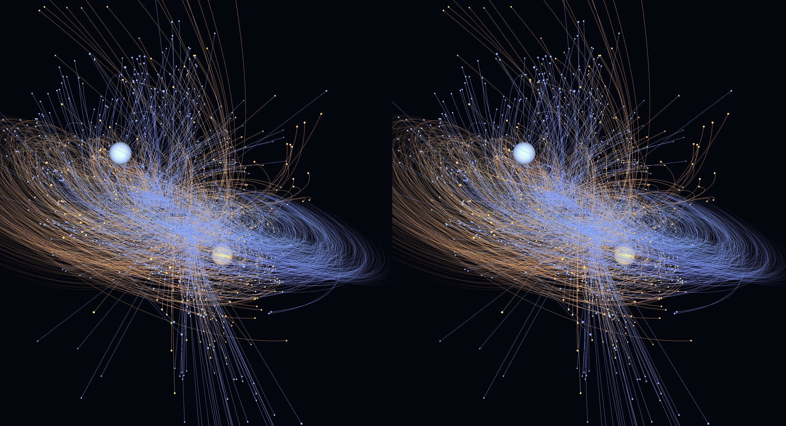

# Gravity3D

A 3D N-body gravity simulator/visualiser in C++ (OpenGL 3.3). Loads a scene of
objects from a file and shows the motion with selectable projections, stereoscopic
3D modes, VR output, adjustable speed, pause/restart, and configurable motion trails.

---

## Screenshot



## Features at a glance

| Requirement | How it's covered |
|---|---|
| Load objects from a file (name, mass, position, velocity, colour) | `data/*.csv`, see **Scene file format** |
| Single-camera projections | Keys `1`–`4`: Front · Isometric · Axonometric · Oblique (cabinet) |
| "American projection" (third-angle) | `F7` **multiview**; key `5` toggles third-angle (American) / first-angle (ISO/European) — see **Projection standards** |
| Anaglyph 3D | `F2` — red/cyan |
| Straight & cross-eye stereo | `F3` (parallel) · `F4` (cross-eye) |
| VR headset | `F5` side-by-side (phone/Cardboard) · `F6` OpenXR (real PC-VR headset, via SteamVR) — see **Running in VR (OpenXR)** |
| Simulation speed | `+` / `-` |
| Gravity solver | `G` toggles Direct O(N²) ↔ **Fast Multipole Method** O(N); `;`/`'` set FMM order — see **Gravity solver: direct vs FMM** · `U` runs the direct sum on the **GPU** (OpenGL compute shader) |
| Pause / restart | `Space` / `R` |
| Trail stays vs. moves with object | `T` cycles Off → Follow (moves along) → Stay (persists) |

---

## Building on Windows

Prerequisites: **Visual Studio 2019/2022** (Desktop C++ workload) and **CMake ≥ 3.16**
(the VS installer includes it). GLFW and GLM are downloaded automatically by CMake;
the OpenGL loader (GLAD) is already vendored in the repo, so there is nothing extra
to install for the core build.

```bat
cd gravity3d
cmake -S . -B build
cmake --build build --config Release
build\Release\gravity3d.exe
```

The build defaults to an optimized, multithreaded Release (it auto-detects your CPU
core count). On GCC/Clang it also compiles with `-O3 -march=native`; turn that off with
`-DGRAVITY3D_NATIVE=OFF` if you need a portable binary. See **Performance** below.

The sample scene is copied next to the executable, so it runs with no arguments.
To load your own file: `gravity3d.exe path\to\your_scene.csv`

### Optional: real VR (OpenXR)

```bat
cmake -S . -B build -DENABLE_OPENXR=ON
cmake --build build --config Release
```

This pulls the Khronos OpenXR-SDK and enables the `F6` headset path. There's an
important runtime requirement (it must be an OpenGL-capable OpenXR runtime, i.e.
SteamVR) — see **Running in VR (OpenXR)** below for the full setup.

> Builds on Linux too (needs `cmake`, `libgl1-mesa-dev`, `xorg-dev`); macOS is
> limited to OpenGL 3.3 / 4.1 and has no OpenXR path.

---

## Controls

```
Projection    1 Front   2 Isometric   3 Axonometric   4 Oblique
View mode     F1 Mono   F2 Anaglyph   F3 Stereo-Parallel   F4 Stereo-Cross
              F7 Multiview (engineering 3-view)
              F5 VR side-by-side (fullscreen it)   F6 VR OpenXR
Multiview     5    toggle Third-angle (American) / First-angle (ISO/European)
Perspective   P    toggle ortho/perspective for Front/Iso/Axono
Trails        T    cycle Off / Follow / Stay
Speed         + / -
Pause         Space          Restart   R
Solver        G    toggle Direct <-> FMM        ; '  lower / raise FMM order
              U    toggle GPU solver (OpenGL compute shader, if available)
Stereo tune   [ ] eye separation      , . convergence distance
VR placement  scroll = scale   arrows = move (up/down/near/far)   drag = rotate   0 = reset
Camera        drag = orbit    scroll = zoom   (zoom also scales the multiview)
Fullscreen    F11            Quit  Esc
```

Current state is always shown in the window title bar. VR-specific controls (`F6`)
are described under **Running in VR (OpenXR)** below.

---

## Running in VR (OpenXR)

`F6` renders true per-eye stereo to a PC-VR headset through OpenXR. It has been run
successfully on a **Meta Quest** via Link / Virtual Desktop → SteamVR. The scene
appears as a small "hologram" floating in front of you that you can scale, move and
rotate.

### 1. Build with the OpenXR path enabled

It's **off by default**. Turn it on and rebuild:

```bat
cmake -S . -B build -DENABLE_OPENXR=ON
cmake --build build --config Release
```

### 2. Use SteamVR as the OpenXR runtime (important)

This app renders with **OpenGL**. Meta's native PC runtime (Oculus / Horizon Link)
and Virtual Desktop's own **VDXR** runtime only accept Direct3D/Vulkan, so an OpenGL
app cannot create a session on them. **SteamVR's runtime does support OpenGL**
(`XR_KHR_opengl_enable`), so route through SteamVR:

- **Meta Quest:** connect via **Link / Air Link**, *or* in **Virtual Desktop** set the
  streaming mode to **SteamVR** (not VDXR). Launch SteamVR — it picks up the Quest as
  the HMD.
- **Make SteamVR the active OpenXR runtime:**
  *SteamVR → Settings → Developer → Set SteamVR as OpenXR Runtime.*

### 3. Run and press `F6`

The console prints OpenXR progress. On success the headset shows the scene in front of
you, and the desktop window keeps mirroring a mono view (handy for onlookers).

### VR placement controls

The simulation is scaled down and floated in front of you (it is **not** room-scale).
Tune it live:

| Control | Action |
|---|---|
| **scroll** | scale the whole model up / down |
| **arrow keys** | Up/Down raise/lower · Left/Right nearer/farther |
| **mouse drag** | rotate the whole hologram (tilt a flat system to see the disc) |
| **`0`** | reset placement to defaults (~1.4 m across, 1.4 m up, 1.6 m in front) |

The default scale is derived from the scene size. The hologram is anchored to the
**STAGE forward** direction, so it appears the way your play space faces — if it isn't
in front of you, turn toward it or nudge it with the arrows.

### Scope & caveats

- **Viewer only:** head tracking, no controller input.
- **Anchored hologram** in STAGE (floor-origin) space — not a room-scale walk-around.
- **Runtime support:** works on any runtime exposing `XR_KHR_opengl_enable`
  (SteamVR confirmed; Monado should work). The native **Oculus/Meta**, **WMR** and
  **VDXR** runtimes are Direct3D/Vulkan-only and will not run it — hence the SteamVR
  requirement above.
- The app requests **OpenXR 1.0** (SteamVR/VDXR implement 1.0); it uses no 1.1 features.

### Troubleshooting

Errors now print their names, so the console tells you what failed. Common ones:

| Message | Meaning / fix |
|---|---|
| `init failed; is a runtime running?` and nothing else | OpenXR path wasn't compiled in — rebuild with `-DENABLE_OPENXR=ON`. |
| `xrCreateInstance failed: XR_ERROR_API_VERSION_UNSUPPORTED (-4)` | Runtime older than the requested API version. The app asks for 1.0, so this only appears on very old runtimes. |
| `xrCreateInstance failed: XR_ERROR_EXTENSION_NOT_PRESENT (-9)` | Active runtime has no OpenGL support — switch the active OpenXR runtime to **SteamVR** (step 2). |
| `XR_ERROR_FORM_FACTOR_UNAVAILABLE (-35)` | Runtime is up but no headset is presenting yet — make sure SteamVR shows the headset **ready/green**, and that Virtual Desktop routes to SteamVR. |
| Nothing in the headset, but the desktop mirror animates | You're likely on `F5` (side-by-side, a phone/Cardboard mode). For a PC headset use **`F6`**. |

> Note: `F5` VR-SBS + fullscreen (`F11`) is for a phone-in-holder viewer. On a PC
> headset it just shows a flat side-by-side image on the mirrored desktop and can
> freeze when going exclusive-fullscreen — use `F6` for real stereo instead.

---

## Scene file format

Plain text. Lines starting with `#` are comments; blank lines are ignored.
Lines starting with `@` are configuration directives. Everything else is one body,
as comma-separated fields:

```
name, mass, px, py, pz, vx, vy, vz, r, g, b [, radius]
```

- Positions/velocities are in arbitrary scene units.
- Colours may be `0..1` floats **or** `0..255` (auto-detected).
- `radius` is optional; if omitted the drawn size is derived from mass.

Config directives (all optional, with defaults):

```
@G=1.0             gravitational constant
@softening=0.05    Plummer softening length (avoids singular close encounters)
@dt=0.004          fixed internal physics timestep
@timescale=1.0     starting speed multiplier
@zeroMomentum=1    subtract net drift so the system stays centred
```

Example (`data/sample_system.csv`): a heavy central star with four orbiters, one on
an inclined elliptical path. For a roughly circular orbit at radius *r* around a
dominant mass *M*, set speed = `sqrt(G*M/r)` perpendicular to the radius.

### Bundled sample scenes

`data/` ships with a set of ready-to-run systems of increasing size, from a 5-body
binary up to a **100 000-body** cloud — a rotating galactic disk, random and uniform
clouds, a globular cluster, merging clusters, colliding galaxies, and several large
systems meant for exercising the FMM. Pass one on the command line, e.g.
`gravity3d.exe data\13_uniform_cloud_100k.csv`. See `data/SCENES.md` for the full list
and tips. (The large clouds `09`–`13` are the ones to try the `G` FMM toggle on.)

Physics: velocity-Verlet integration, with a choice of gravity solver — direct
O(N²) pairwise (default) or an O(N) Fast Multipole Method (press `G`). Both use
Plummer softening. See **Gravity solver: direct vs FMM** below.

---

## Notes & interpretations

### Performance

The force calculation dominates the cost, and it's parallel by nature — each body's
acceleration is an independent sum — so the heavy loops run across all CPU cores.

- **Multithreading.** A small persistent thread pool spreads the work over every core.
  The direct solver parallelises over target bodies; the FMM parallelises each of its
  passes. The two dominant phases — the M2L translations and the near/far evaluation —
  are both balanced across threads: M2L is flattened into one pass over all target cells
  (so coarse tree levels with few cells don't starve threads), and the evaluation is
  parallelised **over bodies rather than cells**, so a dense core (which piles most bodies
  into one octree cell) still spreads evenly instead of landing on a single thread. The
  serial part (tree build, coarse M2M/L2L) is under ~1% of a solve, so scaling is close
  to linear on space-filling scenes. Thread count is auto-detected; override with
  `GRAVITY3D_THREADS`, and the active count prints at startup.
- **Seeing where the time goes.** Set `GRAVITY3D_FMM_PROFILE=1` to print a per-phase
  millisecond breakdown (build / P2M / M2M / M2L / L2L / eval) every 30 solves — handy
  for confirming the split across your cores. On a many-core machine the near-field
  evaluation (`eval`) usually dominates while the M2L translations become nearly free.
- **Tuning the tree for your machine.** `GRAVITY3D_FMM_LEAF` sets the leaf capacity
  `Ncrit` (max points per octree leaf). Smaller leaves shift work from the near-field
  (`eval`) onto the translations (`M2L`); larger leaves do the reverse. The default is
  auto-set from the order; with many cores, watch the profiler and pick the value where
  `M2L` and `eval` roughly balance. Accuracy is unaffected — it's the same result at any
  leaf size.
- **If not all cores look busy.** Two normal reasons, neither a bug: (1) for small or
  fast scenes the FMM finishes a frame in well under the 60 fps budget, so the app idles
  waiting for v-sync — use a large scene (30k–100k) or raise the speed (`+`) to keep the
  cores fed; (2) very concentrated systems (a dense core, a thin disk) do more of their
  work in the near-field, which is heavier but still balanced across bodies.
- **Deterministic.** Every output value is produced by a single thread in a fixed order,
  so results are *bit-for-bit identical* regardless of the thread count — threading only
  changes speed, never the trajectory. (Verified: 1-thread and 8-thread runs match
  exactly for both solvers.)
- **Cache-friendly + vectorised.** Positions and masses are packed into contiguous
  arrays before the inner loop (iterating full body records there is cache-hostile), and
  the loop is branchless. That alone is ~2.4× faster single-threaded, before any
  threads, and `-O3 -march=native` lets the compiler vectorise it.

Rough picture: on one core the direct solver is ~2.5× faster than the original; across a
typical multi-core desktop, several times faster again. The FMM's crossover with direct
(around N≈5000 single-threaded) shifts with core count, and both solvers move a much
larger N at interactive rates than before. For the 3000-star scene, keep an eye on the
title-bar solver readout and try `G` to compare.

### GPU solver (OpenGL compute shader)

Press **`U`** to run the direct O(N²) sum on the GPU instead of the CPU. It's a vendor-
independent OpenGL 4.3 **compute shader** (works on NVIDIA, AMD, and Intel), using the
classic shared-memory tiled N-body kernel — each body streams all others through
workgroup-shared memory. The GPU is enormously parallel, so the pairwise sum that costs
the CPU dearly at large N can run far faster on a discrete card.

Details worth knowing:
- **Precision.** The GPU path is **fp32**; the CPU direct solver stays the
  double-precision ground truth. Measured error of the kernel vs the double sum is
  ~1e-6 relative (max ~1e-5), invisible for a visualiser. The title shows `GPU` when
  it's active.
- **When it helps.** It offloads the *direct* solver, so it shines at large N where the
  O(N²) work dominates. Note the sim is normally **v-sync-capped at 60 fps** — if a
  frame already finishes early, a faster solver just idles more. To feel the GPU, use a
  large scene or raise the speed (`+`) so there's real work per frame.
- **Availability.** Needs a GL 4.3 context (the app now requests one). A startup line
  reports the GPU and whether the solver is available; if the driver is older, `U` is a
  no-op and everything falls back to the CPU.
- **Scope.** This offloads the direct sum, not the FMM's tree passes (irregular, a much
  larger GPU project). For very large N the CPU FMM (`G`) is still the asymptotically
  faster algorithm; the GPU direct path is brute force made cheap by hardware.

### Gravity solver: direct vs FMM

The force calculation is the bottleneck of any N-body code. Two solvers are built in,
switchable live with `G`:

- **Direct** (default) — the exact O(N²) pairwise sum. Simple, exact, and the fastest
  option for the small N of a typical interactive scene. It's also the ground truth.
- **FMM** — a 3D Laplace **Fast Multipole Method**: complex solid-harmonic expansions
  (P2M → M2M → M2L → L2L → L2P) over an **adaptive octree**, with a direct near-field.
  The tree subdivides only where mass is dense (≤ a leaf-capacity `Ncrit` points per
  leaf), and a **dual tree traversal** decides, for each pair of cells, whether they are
  far enough apart to translate (M2L) or must be summed directly (P2P). Bounding leaf
  occupancy keeps the near-field ~O(N) no matter how concentrated the system becomes —
  so a collapsing cloud or a dense core stays fast, where a fixed uniform grid would
  bog down.

**Accuracy.** The FMM is an approximation whose error is controlled by the expansion
order *p* (`;` / `'` to change it). Measured relative L2 error of the accelerations
against the direct sum, on a uniform random cloud:

| order *p* | 2 | 4 | 6 | 8 |
|---|---|---|---|---|
| rel. L2 error | ~9×10⁻³ | ~9×10⁻⁴ | ~1×10⁻⁴ | ~2×10⁻⁵ |

The default is *p* = 4 (≈0.1 %), which is comfortably accurate for visualisation. Each
translation operator was validated independently against direct summation, and the two
solvers were checked to produce matching trajectories through the integrator.

**Performance / when to use which.** The FMM has real per-step overhead (building the
tree and the expansions), so for small N the direct sum wins outright. The crossover on
one core is around **N ≈ 5000**; beyond it the FMM pulls away quickly (roughly linear
scaling), e.g. at N = 200 000 it is tens of × faster than direct. Rule of thumb: leave
it on **Direct** for ordinary scenes, switch to **FMM** (`G`) when you want to push the
body count into the thousands and beyond. The window title shows the active solver.

**Honest caveats.**
- The octree is **adaptive**: it refines only where mass is dense, so leaf occupancy is
  bounded everywhere and the near-field stays ~O(N) even for a dense core or a
  collapsing cloud. Interactions are found by a dual tree traversal (well-separated →
  M2L, near leaves → direct), which handles cells of differing sizes automatically.
- Softening is applied in the **near-field only** (the exact 1/r kernel is used in the
  far field). This is physically consistent because far-field pairs are well separated,
  so softening there would be negligible anyway; close encounters — where softening
  matters — always fall in the near-field.
- Far-field forces are the gradient of the local expansion, taken by central finite
  differences of a smooth field (the near-field uses the exact analytic softened force).
- It's a single-threaded-scalar operator core run in parallel across cells/bodies.
  Production FMMs add rotation-based or FFT M2L (dropping each translation from O(p⁴) to
  O(p³)), which is the next constant-factor win; that's optimization, not a correctness
  fix.

### Projection standards (the "American projection")

In technical drawing, "American projection" means **third-angle** orthographic
projection, and the ISO/European standard is **first-angle**. Both show the *same*
orthographic views (front, top, side) — the difference is purely *where each view is
placed* relative to the front view. Third-angle puts each view where the eye naturally
expects it (the object is behind a pane of glass you look through); first-angle flips
top↔bottom and left↔right (the object casts its image onto a plane behind it).

Press `F7` for the **multiview** mode and `5` to switch standard. The layout:

```
   THIRD-ANGLE (American)          FIRST-ANGLE (ISO / European)
  +-----------+-----------+       +-----------+-----------+
  |   TOP     |   (iso)   |       |  RIGHT    |   FRONT   |
  +-----------+-----------+       +-----------+-----------+
  |  FRONT    |  RIGHT    |       |  (iso)    |   TOP     |
  +-----------+-----------+       +-----------+-----------+
   top ABOVE front,                top BELOW front,
   right-view to the RIGHT         right-view to the LEFT
```

The fourth cell shows an isometric for reference (not part of the standard). All four
panels share one orthographic scale, so sizes are directly comparable, and scroll-zoom
scales them together. The single-camera presets remain available too: **Axonometric**
(`3`) and **cabinet Oblique** (`4`), alongside Front (`1`) and Isometric (`2`); mouse
free-orbit reaches any exact angle. If you'd prefer a different oblique (cavalier vs
cabinet) or a specific axonometric ratio for those presets, it's a one-line change in
`Camera.cpp`.

- **Stereo.** Anaglyph and side-by-side use correct off-axis (parallel-axis) frusta
  with tunable eye separation (`[` `]`) and convergence (`,` `.`). Straight vs
  cross-eye is just which image goes to which half. If depth looks inverted for you,
  nudge eye separation or swap `F3`/`F4`.

- **VR.** `F5` (side-by-side) works with a phone-in-holder viewer or any display that
  accepts SBS. `F6` is the real OpenXR headset path (instance → session → per-eye
  swapchains → frame loop → projection layer), confirmed on a Meta Quest via
  Link / Virtual Desktop → SteamVR. It's viewer-only (head tracking, no controllers)
  and needs an OpenGL-capable OpenXR runtime — full setup under
  **Running in VR (OpenXR)**.
